# Gemini3Particles

Real-time particle and firefly visualization for iOS 26, built with Metal compute shaders and SwiftUI.

## Particles

GPU-driven particles flow toward target positions to form glyphs, custom text, or sampled photo data. Touch displaces nearby particles with velocity-based haptic feedback. Background shooting stars streak across the scene.

<p align="center">
  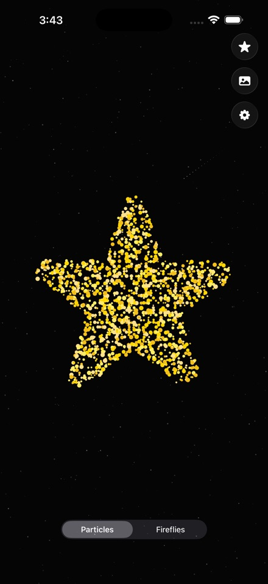
  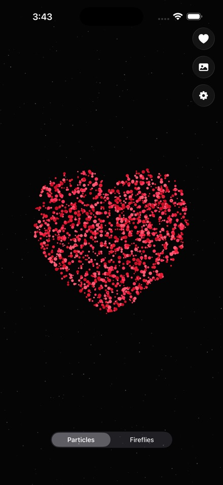
  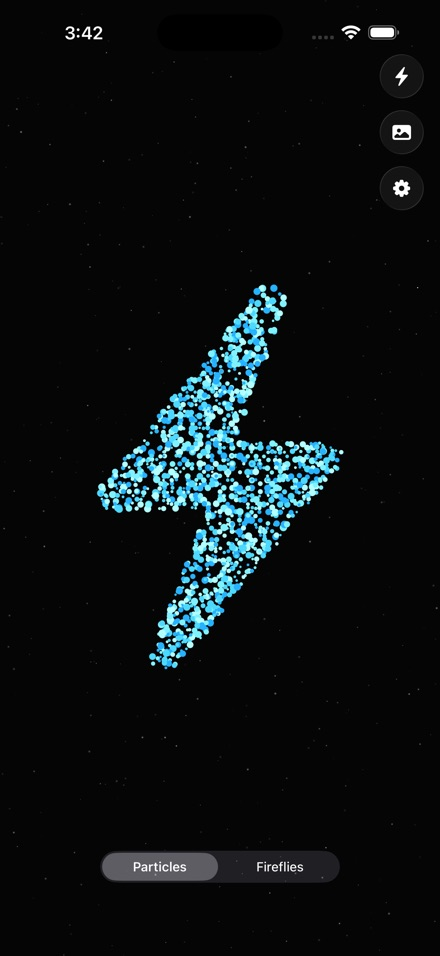
  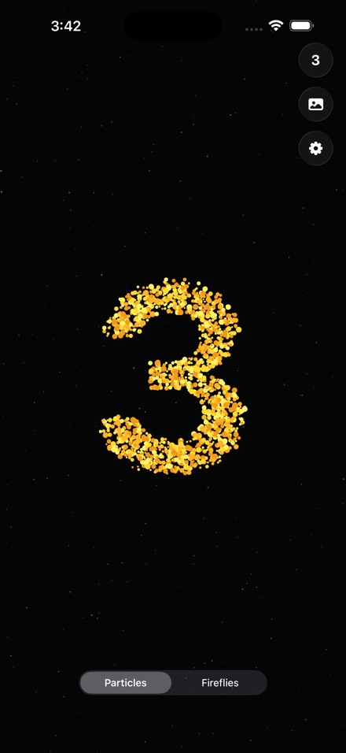
</p>

<p align="center">
  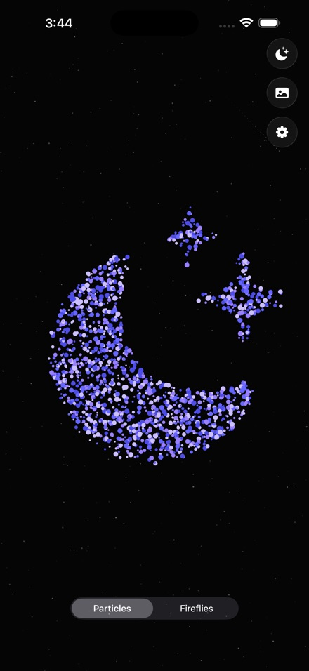
  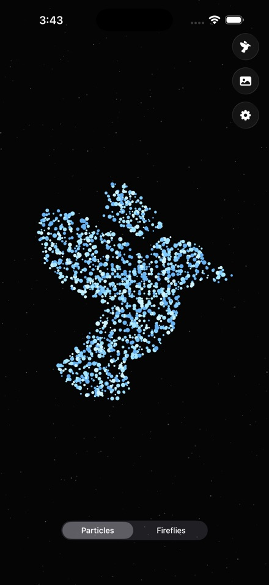
  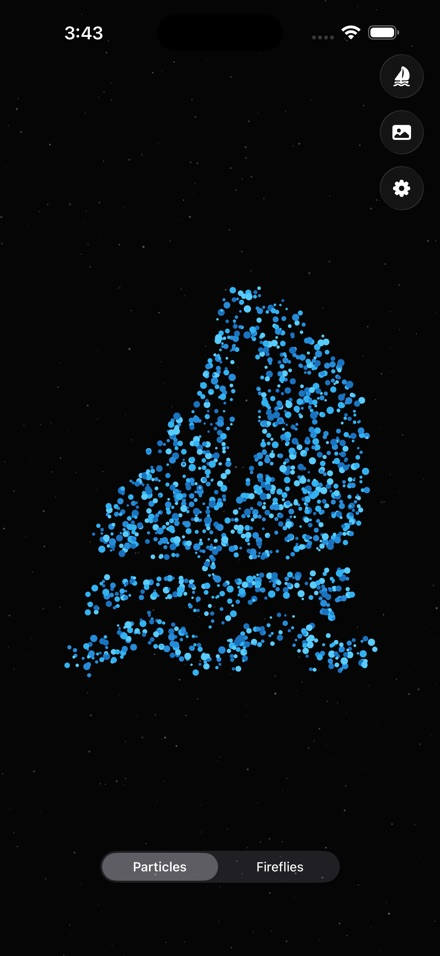
</p>

## Fireflies

Organic glowing fireflies converge into shapes with natural wandering behavior, glow pulsing, and realistic flash patterns. Double-tap to scatter into free-roaming mode, double-tap again to reform.

<p align="center">
  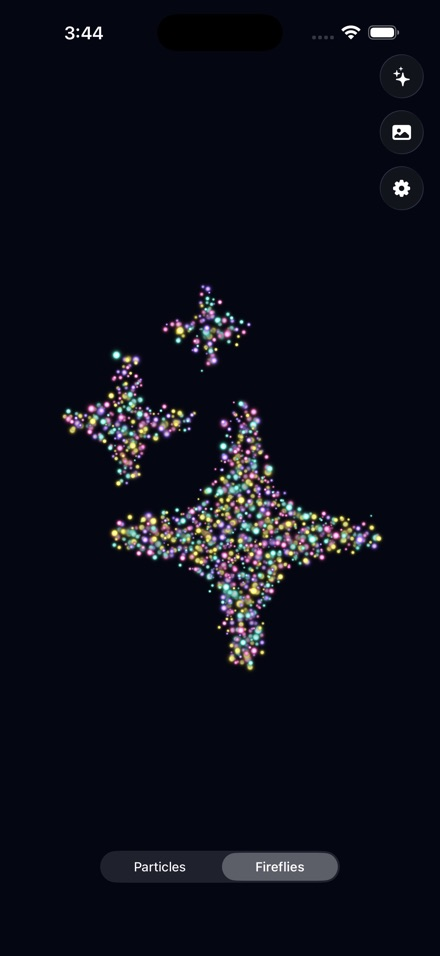
  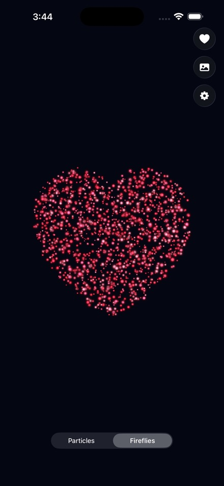
  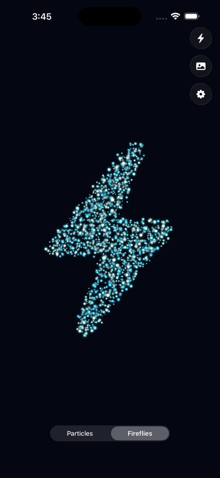
  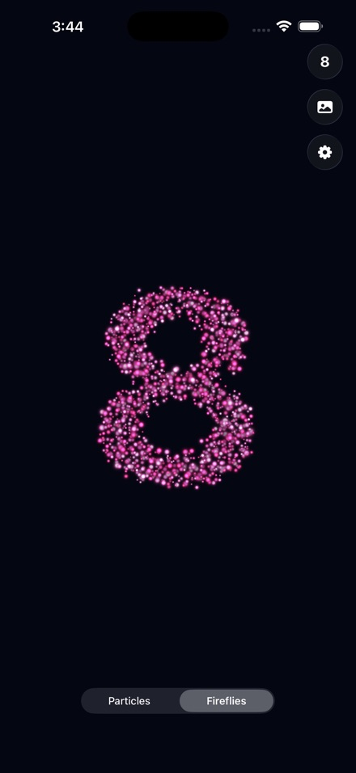
</p>

<p align="center">
  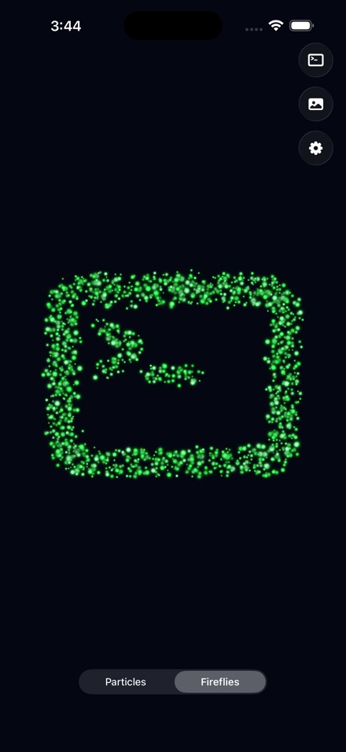
</p>

### Demo

<!-- To get an inline video player: open this repo on GitHub, edit the README, drag your video file into the editor, and GitHub will generate a https://github.com/user-attachments/assets/... URL. Replace the link below with that URL. -->

https://github.com/babanikrishna/gemini3particles/raw/main/Assets/Fireflies/demo.mp4

## Features

- **Metal compute shaders** for GPU-accelerated particle simulation at 120fps
- **40+ glyphs** including digits, SF Symbols, and categorized collections
- **Custom text input** rendered as particle formations
- **Photo import** with Vision framework subject detection
- **Touch interaction** with physics-based displacement and velocity haptics
- **Shake to randomize** the current shape
- **Liquid Glass** UI controls (iOS 26)
- **30 color schemes** mapped to glyphs

## Architecture

```
Gemini3Particles/
  App/
    Gemini3ParticlesApp.swift       App entry point
    ContentView.swift               Mode switching between Particles and Fireflies

  Particles/
    ParticleTypes.swift             GPU struct definitions (ParticleData, Uniforms, StarData)
    ParticleRenderer.swift          Metal compute + render pipeline, haptics, shooting stars
    ParticleShaders.metal           GPU kernels: formation easing, wobble, touch repulsion
    ParticleEffectView.swift        SwiftUI view, gesture handling, settings sheet

  Fireflies/
    FireflyTypes.swift              GPU struct definitions (FireflyData, Uniforms)
    FireflyRenderer.swift           Metal pipeline, scatter/reform, per-fly personality
    FireflyShaders.metal            GPU kernels: naturalistic flight, flash patterns, glow
    FireflyEffectView.swift         SwiftUI view, double-tap scatter, settings sheet

  General/
    GlyphCatalog.swift              Glyph definitions, categories, bitmap rendering + sampling
    ColorSchemes.swift              30 named color palettes for digits and symbols
    PhotoSampler.swift              Vision subject detection, photo point sampling
    ParticleConfig.swift            @Observable shared configuration state
    ShapeControls.swift             Liquid Glass shape picker overlay
    ShakeDetector.swift             Device shake notification bridge
    MetalUtilities.swift            Alpha blending configuration
```

### Metal Pipeline

Both modes follow the same two-pass pattern per frame:

1. **Compute pass** — GPU kernel updates particle positions, velocities, brightness, and color interpolation
2. **Render pass** — Point sprites drawn with per-particle size, color, and alpha; fragment shaders produce soft circles (particles) or crisp glow rings (fireflies)

## Requirements

- iOS 26.0+
- Xcode 26+
- Metal-capable device (simulator not recommended)

## Build

```bash
open Gemini3Particles.xcodeproj
```

Build and run on a physical device. Best experienced on ProMotion displays (120Hz).

## License

MIT
